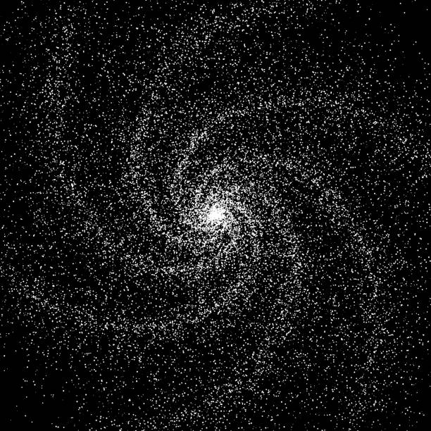
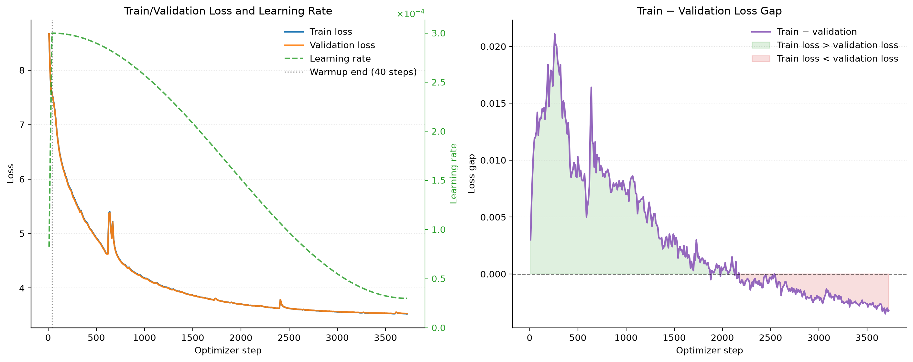

<div align="center">
  <div>
      
  </div>

  <h1>
    mesoGPT
  </h1>
        
  <h2>
    Building and training large language models from scratch.
  </h2>

</div>


mesoGPT is a language-model built from scratch to understand transformer architecture, training and its efficiency at a manageable scale.

The current baseline is a 97.7M-parameter decoder-only Transformer pretrained on approximately 1.95B tokens using a single NVIDIA L40S.

> Status: baseline pretraining is complete. The next phase focuses on profiling and improving training efficiency.

## Baseline results

| Metric                    |           Result |
| ------------------------- | ---------------: |
| Parameters                |       97,655,296 |
| Training tokens processed |    1,953,497,088 |
| Context length            |            1,024 |
| Vocabulary size           |           16,384 |
| Best validation loss      |           3.5299 |
| Best validation BPB       |           1.1509 |
| Training time             |      20h 47m 48s |
| Throughput                | ~26,093 tokens/s |
| Hardware                  |   1× NVIDIA L40S |
| Training cost   |           $39.08 |

## What is implemented

* Byte-level BPE tokenizer training with `rustbpe`
* Fast encoding and decoding through `tiktoken`
* Streaming Parquet dataset pipeline
* Decoder-only Transformer implemented in PyTorch
* Rotary positional embeddings
* Fused QKV projection
* Pre-LayerNorm Transformer blocks
* Tied token-embedding and language-model-head weights
* BF16/FP16 mixed-precision training
* Gradient accumulation and cosine learning-rate decay
* Validation using loss and bits per byte
* Best-checkpoint saving with model metadata
* GPU utilization, memory and cost tracking
* Text generation from saved experiment checkpoints

## Project pipeline

```text
ClimbMix Parquet shards
        ↓
Byte-level BPE tokenizer
        ↓
Streaming token dataloader
        ↓
Decoder-only Transformer
        ↓
Pretraining and validation
        ↓
Checkpoint and metadata
        ↓
Text generation
```

## Experiments

### [Experiment 001: Tokenizer training-data scaling](experiments/exp_001/README.md)


Measured how tokenizer-training corpus size affects held-out compression while keeping the vocabulary fixed at 16,384 tokens.

Eleven tokenizers were trained using between 25M and 500M characters. The 250M-character tokenizer captured approximately 97.2% of the total compression improvement observed between the 25M and best-performing 450M conditions.

### [Experiment 002: Baseline language-model pretraining](experiments/exp_002/README.md)



Pretrained a 97.7M-parameter GPT-style model on approximately 1.95B tokens.

The model reached a best validation loss of 3.5299 and validation BPB of 1.1509 after 3,720 optimizer steps.

## Model architecture

| Component           | Configuration |
| ------------------- | ------------: |
| Transformer blocks  |         12 |
| Model dimension     |           768 |
| Attention heads     |            12 |
| Head dimension      |            64 |
| Context length      |         1,024 |
| Vocabulary size     |        16,384 |
| Activation          |          GELU |
| Positional encoding |          RoPE |
| Dropout             |           0.1 |

## Repository structure

```text
mesoGPT/
├── mesoGPT/
│   ├── common.py
│   ├── dataloader.py
│   ├── dataset.py
│   ├── model_registry.py
│   └── tokenizer.py
│
├── experiments/
│   ├── exp_001/
│   │   ├── README.md
│   │   └── tok_train.py
│   └── exp_002/
│       ├── README.md
│       ├── base_train.py
│       └── model.py
│
├── scripts/
│   ├── data_stats.py
│   ├── model_stats.py
│   └── sample.py
│
├── runs/
│   ├── exp_001.sh
│   └── exp_002.sh
│
├── pyproject.toml
└── setup.sh
```

## Installation

mesoGPT requires Python 3.11 through 3.14.

On Ubuntu or WSL, install the system prerequisites first:

```bash
sudo apt update
sudo apt install -y git git-lfs python3 python3-venv time
```

### Setup

```bash
git clone https://github.com/shanthan5589/mesoGPT.git
cd mesoGPT
bash setup.sh
source .venv/bin/activate
```

`setup.sh` creates a project-local virtual environment, reuses a compatible
PyTorch installation when one is already available, installs missing
dependencies, and checks whether CUDA is available. CPU-only environments are supported for development, although full pretraining requires a suitable GPU.

If multiple Python versions are installed, select one explicitly:

```bash
PYTHON_BIN=python3.12 bash setup.sh
```

## Downloading the dataset

Download training shards together with the fixed tokenizer-validation and model-validation shards:

```bash
python -m mesoGPT.dataset -n 15
```

Dataset files are saved locally under `data/` and are not committed to Git.

## Reproducing the experiments

Tokenizer scaling experiment:

```bash
bash runs/exp_001.sh
```

Baseline language-model pretraining:

```bash
bash runs/exp_002.sh
```

Full configurations, measurements and limitations are documented in the corresponding experiment reports.

## Generating text

Model checkpoints are stored using Git LFS. After cloning the repository, retrieve them with:

```bash
git lfs install
git lfs pull
```

Generate text from a checkpoint:

```bash
python scripts/sample.py \
  experiments/exp_002/runs/2026-09-05_11-41-45_UTC \
  --prompt "The future of artificial intelligence" \
  --max-tokens 100 \
  --temperature 0.8
```

## Current limitations

* The baseline uses an explicit attention implementation rather than optimized SDPA or Flash Attention.
* Tokens are produced dynamically by the dataloader instead of being pretokenized.
* The measured model FLOP utilization is approximately 4%.
* Dataset order and exact shard identity are not yet captured in a run manifest.
* The model has not undergone instruction tuning or preference optimization.


## License

This project is released under the [MIT License](LICENSE).
