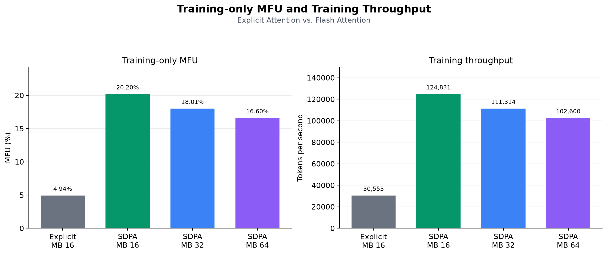

<div align="center">
  <div>
      
  </div>

  <h1>
    mesoGPT
  </h1>

  <h2>
    Building and training large language models from scratch.
  </h2>

</div>


mesoGPT is a language-model built from scratch to understand transformer architecture, training and its efficiency at a manageable scale.

The current baseline is a 97.7M-parameter decoder-only Transformer pretrained on approximately 1.95B tokens using a single NVIDIA L40S.

If you have any questions, I recommend using [DeepWiki](https://deepwiki.com/shanthan5589/mesoGPT) to get answers in a structured and organized manner. 

## Baseline results

| Metric                    |           Result |
| ------------------------- | ---------------: |
| Parameters                |       97,655,296 |
| Training tokens processed |    1,953,497,088 |
| Context length            |            1,024 |
| Vocabulary size           |           16,384 |
| Best validation loss      |           3.5299 |
| Best validation BPB       |           1.1509 |
| Training time             |      20h 47m 48s |
| Throughput                | ~26,093 tokens/s |
| Hardware                  |   1× NVIDIA L40S |
| Training cost   |           $38.70 |

## What is implemented

* Byte-level BPE tokenizer training with `rustbpe`
* Fast encoding and decoding through `tiktoken`
* Streaming Parquet dataset pipeline
* Decoder-only Transformer implemented in PyTorch
* Rotary positional embeddings
* Fused QKV projection
* Pre-LayerNorm Transformer blocks
* Tied token-embedding and language-model-head weights
* BF16/FP16 mixed-precision training
* Gradient accumulation and cosine learning-rate decay
* Validation using loss and bits per byte
* Best-checkpoint saving with model metadata
* GPU utilization, memory and cost tracking
* Text generation from saved experiment checkpoints

## Project pipeline

```text
ClimbMix Parquet shards
        ↓
Byte-level BPE tokenizer
        ↓
Streaming token dataloader
        ↓
Decoder-only Transformer
        ↓
Pretraining and validation
        ↓
Checkpoint and metadata
        ↓
Text generation
```

## Experiments

### [Experiment 1: Tokenizer training-data scaling](experiments/exp_001/README.md)


Measured how tokenizer-training corpus size affects held-out compression while keeping the vocabulary fixed at 16,384 tokens.

Eleven tokenizers were trained using between 25M and 500M characters. The 250M-character tokenizer captured approximately 97.2% of the total compression improvement observed between the 25M and best-performing 450M tokenizer.

### [Experiment 2: Baseline language-model pretraining](experiments/exp_002/README.md)


Pretrained a 97.7M-parameter decoder-only transformer on approximately 1.95B tokens.

The model reached a best validation loss of 3.5299 and validation BPB of 1.1509 after 3,720 optimizer steps. Model FLOP utilization (MFU) of 4.22% was achieved, indicating substantial headroom for improving training-system efficiency.

Refer [Compute and Cost estimations](/experiments/exp_002/training_compute_estimation.md) to understand how the training compute budget, efficiency, performance, time, cost and other metrics were estimated and calculated in detail.

### [Experiment 3:  Accelerating Attention with Flash Attention](experiments/exp_003/README.md)



Replaced the model’s explicit causal-attention implementation with PyTorch's SDPA (which used its built-in Flash attention implementation) and benchmarked micro-batch sizes of 16, 32, and 64 while keeping the global batch size fixed at 512 sequences.

The best configuration, with a micro-batch size of 16, achieved a throughput of 124,831 tokens/s and a MFU of 20.20% which is approximately 4.09× higher throughput and 4.09× faster optimizer-update time than the baseline. Peak GPU memory usage decreased from 27,969 to 12,457 MiB (2.25× lower).

This is a short performance run rather than a complete pretraining run. Consequently, this experiment evaluates training-system efficiency not final model quality or convergence.

Overall this experiment demonstrates that Flash attention can significantly improve training throughput and efficiency for the baseline model architecture.


## Model architecture

| Component           | Configuration |
| ------------------- | ------------: |
| Transformer blocks  |         12 |
| Model dimension     |           768 |
| Attention heads     |            12 |
| Head dimension      |            64 |
| Context length      |         1,024 |
| Vocabulary size     |        16,384 |
| Activation          |          GELU |
| Positional encoding |          RoPE |
| Dropout             |           0.1 |

## Repository structure

```text
mesoGPT/
├── assets/
│
├── data/               # Downloaded shards are stored here. Not committed to Git.
│
├── experiments/
│   ├── exp_001/
│   │   ├── README.md
│   │   └── assets/
│   ├── exp_002/
│   │   ├── README.md
│   │   ├── training_compute_estimation.md
│   │   └── assets/
│   └── exp_003/
│       ├── README.md
│       ├── estimations.py
│       └── assets/
│
├── launchers/
│   ├── exp_001.sh
│   ├── exp_002.sh
│   └── exp_003.sh
│
├── outputs/
│   ├── exp_001/
│   ├── exp_002/
│   └── exp_003/
│
├── src/
│   └── mesoGPT/
│       ├── __init__.py
│       ├── paths.py
│       ├── dataset/
│       │   ├── __init__.py
│       │   ├── __main__.py
│       │   ├── dataset.py
│       │   └── dataloader.py
│       ├── models/
│       │   ├── __init__.py
│       │   ├── model.py
│       │   └── registry.py
│       ├── tokenizer/
│       │   ├── __init__.py
│       │   └── tokenizer.py
│       ├── training/
│       │   ├── __init__.py
│       │   ├── tok_train.py
│       │   └── trainer.py
│       └── utils/
│           ├── __init__.py
│           ├── data_stats.py
│           ├── model_stats.py
│           └── sample.py
│
├── .gitattributes
├── .gitignore
├── LICENSE
├── README.md
├── pyproject.toml
└── setup.sh
```

## Installation

This installation guide assumes you are using Linux, macOS or WSL. Windows users can use WSL or a Linux virtual machine.

Clone the project:

```bash
git clone https://github.com/shanthan5589/mesoGPT.git   # HTTPS
git clone git@github.com:shanthan5589/mesoGPT.git       # SSH
gh repo clone shanthan5589/mesoGPT                      # Github CLI
cd mesoGPT
```

Install the system prerequisites if they are not already installed:

```bash
sudo apt update
sudo apt install -y git python3 python3-venv time
python3 --version
```

Then verify if the Python version is between 3.11 and 3.14. If it is not, install a supported Python version with `venv` support using your operating system's package manager or the [official Python installers](https://www.python.org/downloads/). Then replace `python3.11` in the command below with the version you installed; for example, use `python3.12` if you installed Python 3.12.

Create and activate the virtual environment:

```bash
python3.11 -m venv .venv
source .venv/bin/activate
```

Install dependencies:

```bash
bash setup.sh gpu       # GPU
bash setup.sh cpu       # CPU-only
```

## Downloading the dataset

Download training shards together with the fixed tokenizer-validation and model-validation shards:

```bash
python -m mesoGPT.dataset -n 15
```

Dataset files are saved locally under `data/` and are not committed to Git.

## Reproducing the experiments

Tokenizer scaling experiment:

```bash
bash launchers/exp_001.sh
```

Baseline language-model pretraining:

```bash
bash launchers/exp_002.sh
```

Accelerating attention with Flash attention:

```bash
bash launchers/exp_003.sh
```

Full configurations, measurements and limitations are documented in the corresponding experiment reports.

## Generating text

Model checkpoints are stored using Git LFS. After cloning the repository, retrieve them with:

```bash
git lfs install
git lfs pull
```

Generate text from a checkpoint:

```bash
python src/mesoGPT/utils/sample.py \
  "checkpoint directory" \
  --tokenizer-dir "outputs/exp_001/<tokenizer-run-timestamp>" \
  --tokenizer-name "tok-v16384-c450.00m" \
  --prompt "Hello" \
  --max-tokens 100 \
  --temperature 0.8
```

## License

This project is released under the [MIT License](LICENSE).