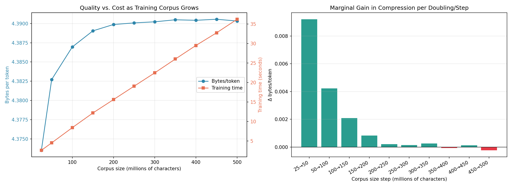

# Experiment: Scaling Tokenizer Training Data at Fixed Vocabulary Size

<!-- ## Research Question

How does the amount of tokenizer-training text affect the held-out
compression efficiency of a byte-level BPE tokenizer when vocabulary size
and all other tokenizer settings are held constant? -->

## Hypothesis

Increasing the amount of tokenizer-training text will improve compression
on unseen text, measured by higher characters per token and bytes per token
and lower tokens per word. The improvement is expected to exhibit
diminishing returns as the training corpus grows.

## Experimental Design

### Independent variable

Number of characters used to train the tokenizer:

25M, 50M, 100M, 150M, 200M, 250M, 300M, 350M, 400M, 450M, and 500M.


### Dataset

- Dataset name: `karpathy/climbmix-400b-shuffle`
- Dataset version: - 
- License: MIT
- Number of documents per shard: 86,016 (86K)
- Raw Characters per shard: ~252,606,075.5 (252.6M)
- Maximum characters contributed by one document: 2937
- Storage per shard: 92 MB
- Total Training shards used: 4
- Validation shards: 1
- Duplicate removal: - 
- Document-length statistics: -

### Controlled variables

- Tokenizer: byte-level BPE implemented with `rustbpe`
- Encoder: `tiktoken`
- Vocabulary size: 16,384 tokens
- Reserved special tokens: 9
- Training-document order: fixed
- Evaluation corpus: fixed held-out tokenizer-validation shard

Because every run reads the training corpus in the same order, the datasets
are nested prefixes: each larger condition contains the data used by the
smaller conditions plus additional text.


The reported compression metrics are:

```math
\text{Characters per token}
=
\frac{\text{held-out characters}}{\text{produced tokens}}
```

```math
\text{Bytes per token}
=
\frac{\text{held-out UTF-8 bytes}}{\text{produced tokens}}
```

```math
\text{Tokens per word}
=
\frac{\text{produced tokens}}{\text{held-out words}}
```

Higher characters per token and bytes per token indicate better
compression. Lower tokens per word also indicates better compression.

## Results



| Training characters | Validation tokens | Characters/token | Bytes/token | Tokens/word | Training time |
|--------------------:|------------------:|-----------------:|------------:|------------:|--------------:|
| 25M  | 57,837,759 | 4.366152 | 4.373523 | 1.368411 | 2.58 s |
| 50M  | 57,716,339 | 4.375337 | 4.382724 | 1.365539 | 4.50 s |
| 100M | 57,660,670 | 4.379561 | 4.386955 | 1.364222 | 8.40 s |
| 150M | 57,633,217 | 4.381647 | 4.389045 | 1.363572 | 12.17 s |
| 200M | 57,622,374 | 4.382472 | 4.389871 | 1.363315 | 15.61 s |
| 250M | 57,619,655 | 4.382679 | 4.390078 | 1.363251 | 19.05 s |
| 300M | 57,617,777 | 4.382822 | 4.390221 | 1.363207 | 22.47 s |
| 350M | 57,614,322 | 4.383084 | 4.390484 | 1.363125 | 26.02 s |
| 400M | 57,615,179 | 4.383019 | 4.390419 | 1.363145 | 29.51 s |
| 450M | **57,613,409** | **4.383154** | **4.390554** | **1.363103** | 32.75 s |
| 500M | 57,616,429 | 4.382924 | 4.390324 | 1.363175 | 36.24 s |

All tokenizer round-trip tests passed.

## Analysis

The best measured compression was obtained with 450M training characters.
Compared with the 25M-character tokenizer, it produced 224,350 fewer tokens 
on the validation corpus.

Most of the improvement occurred before 250M characters. The 250M
tokenizer captured approximately 97.2% of the total validation-token
reduction observed between the 25M and 450M conditions. Increasing the
training corpus from 250M to 450M characters reduced the validation output
by only another 6,246 tokens while increasing tokenizer-training time from
19.05 to 32.75 seconds.

Performance was not strictly monotonic: the 400M and 500M conditions were
slightly worse than the 350M and 450M conditions, respectively. Therefore,
the experiment supports a diminishing-returns relationship rather than the
claim that every increase in training data necessarily improves
compression.

## Conclusion

Increasing tokenizer-training data improved held-out compression at a
fixed vocabulary size, but the gains became very small after approximately
250M characters.

The 450M-character tokenizer achieved the best result in this run. However,
the 250M-character tokenizer provides a better efficiency trade-off,
because it obtains nearly all of the observed compression improvement with
substantially less training time.

## Limitations

- Only one run was performed for each training size.
- Training examples were selected in a fixed order rather than as
  independently sampled corpora.
- Results are specific to a 16,384-token vocabulary and this dataset.
- Word counts depend on the regular expression used by the evaluation
  script.

Consequently, small differences among the 250M–500M conditions should not
be interpreted as statistically significant.

## Reproduction

From the repository root:

```bash
bash runs/exp_001.sh
```