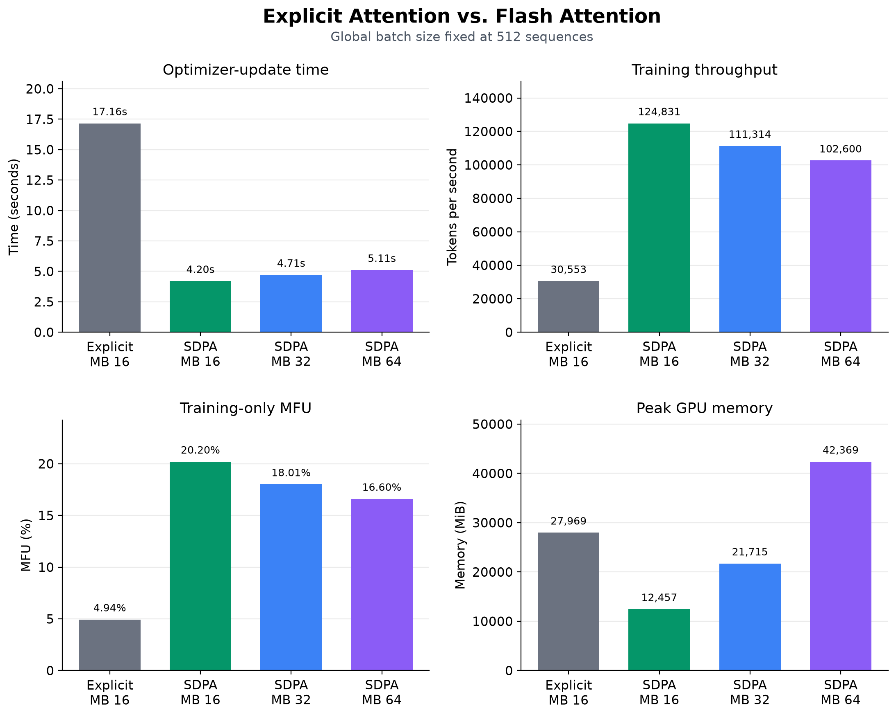
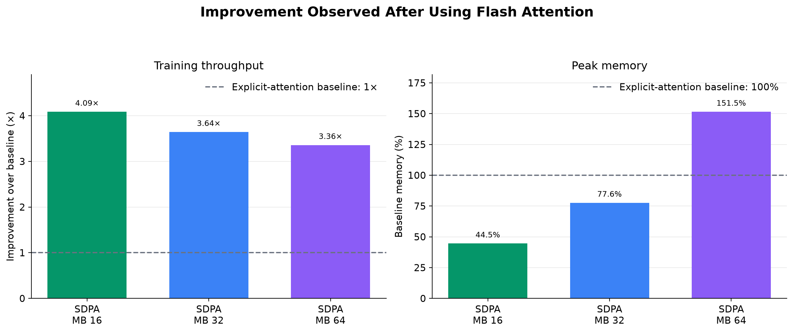

# Experiment 003:  Accelerating Attention with Flash Attention

## Summary

This experiment evaluated Flash attention as a replacement for the explicit causal-attention implementation used in [Baseline Language-Model Pretraining](../exp_002/README.md). The model architecture and training configuration were otherwise unchanged.

On a single NVIDIA L40S GPU, the best-performing Flash attention configuration used a micro-batch size of 16. Compared with the baseline, Flash attention reduced the optimizer-update time from 17.16 to 4.20 seconds, increased training throughput from 30,553 tokens/s to 124,831 tokens/s, and raised the estimated training-only model FLOP utilization (MFU) from 4.94% to 20.20%. Peak GPU memory usage decreased from 27,969 to 12,457 MiB.

This corresponds to approximately:

- 4.09× higher training throughput;
- 4.09× faster optimizer-update time;
- 2.25× lower peak GPU memory.

Micro-batch sizes 32 and 64 were also tested. Neither exceeded the performance
of micro-batch size 16.

*Figure 1: MFU and Throughput improvement with Flash attention.*
*Explicit refers to the manual implementation of causal attention and SDPA refers to Flash attention. MB refers to micro-batch size.*

These were short performance runs rather than complete pretraining runs.
Consequently, this experiment evaluates training-system efficiency not final model quality or convergence.

## Experimental Design

The model architecture mentioned in [Baseline Language-Model Pretraining](../exp_002/README.md) was used in this experiment.

| Variable | Value |
|---|---:|
| Trainable parameters | 97,655,296 |
| Transformer blocks | 12 |
| Model width | 768 |
| Attention heads | 12 |
| Head dimension | 64 |
| Context length | 1,024 |
| Vocabulary size | 16,384 |
| Global batch size | 512 sequences |
| Tokens per optimizer update | 524,288 |
| Precision | BF16 mixed precision |
| Dropout | 0.1 |

One implementation detail was changed:

- Explicit causal attention was replaced with Flash attention.

The performance with Flash attention was evaluated across different micro-batch sizes 16, 32, and 64 while preserving a global batch size of 512.

## Change Introduced

The baseline explicitly implemented the attention mechanism:

    QKᵀ → scale → causal mask → softmax → dropout → multiply by V

Experiment 3 replaced this sequence with:

    torch.nn.functional.scaled_dot_product_attention(
        q,
        k,
        v,
        dropout_p=...,
        is_causal=True,
    )

*According to the logs, its been observed that PyTorch SDPA selected 
its built-in Flash attention implementation to compute the attention mechanism efficiently.*
No learned layers or model dimensions were changed. The causal-mask buffer was
removed because causal masking is handled internally by Pytorch SDPA.

## Performance Results

*Figure 2: Performance comparison between explicit causal attention and Flash attention.*
*Explicit refers to the manual implementation of causal attention and SDPA refers to Flash attention. MB refers to micro-batch size.*

| Attention | Micro-batch | Observed update time | Throughput | Estimated MFU | Peak GPU memory | Estimated Training Time |
|---|---:|---:|---:|---:|---:|---:|
| Explicit attention | 16 | 17.16 s | 30,553 tok/s | 4.94% | 27,969 MiB | 17.761 hrs
| Flash Attention | 16 | **4.20 s** | **124,831 tok/s** | **20.20%** | **12,457 MiB** | 4.347 hrs 
| Flash Attention | 32 | 4.71 s | 111,314 tok/s | 18.01% | 21,715 MiB | 4.875 hrs 
| Flash Attention | 64 | 5.11 s | 102,600 tok/s | 16.60% | 42,369 MiB | 5.289 hrs  

*Note: The observed update time is the maximum time taken to complete a single optimizer step. The time taken for the first optimizer step is excluded because it often takes longer time than subsequent steps due to initialization overhead.*

### Sources

The optimizer updates times for each run were recorded in the training logs. The rest of the metrics were calculated using the algorithm described in [estimations.py](estimations.py).

The sources for the optimizer-update times are listed in the table below:

| Experiment Number | Run ID | Line Number in Training Log |
|---|---:|---:|
| 002 | `2026-09-05_10-22-52_UTC` | 94
| 003 | `2026-09-13_13-24-25_UTC` | 145
| 003 | `2026-09-13_13-30-42_UTC` | 159
| 003 | `2026-09-13_13-35-16_UTC` | 146

## Notes on Metrics and MFU:

Metrics such as throughput, model FLOP utilization (MFU), and estimated training time are calculated using only the observed optimizer-update time,  time spent on evaluation is excluded. Including time spent on evaluation would make results dependent on the chosen evaluation frequency. For example, a run with more frequent evaluation would appear to have lower throughput, lower MFU, and a longer estimated training time than an otherwise identical run with less frequent evaluation. Excluding evaluation time therefore enables a fair comparison of training performance across experiments.

However in [Baseline Language-Model Pretraining](../exp_002/README.md), where the 
model was trained on 1.95B tokens, across 3726 optimizer steps, the reported throughput, MFU, and other metrics were calculated using the measured wall clock time which includes the total time taken for the entire training process, including time spent on training and time spent on evaluation as well.

**Note on the baseline MFU**: The baseline value of 4.94% is calculated solely from the measured optimizer-update time and excludes evaluation, checkpointing, startup, and other end-to-end overhead. It therefore differs from the 4.22% end-to-end MFU reported in Experiment 2, which was calculated using the complete training run’s wall-clock time. Because Experiment 3 consists of short benchmark runs rather than complete pretraining runs, using optimizer-update times for all of them provides an apple to apple comparison. The values 4.94% and 4.22% are therefore not conflicting measurements, they are simply calculated for different purposes. The 4.94% value is used in this experiment to provide a fair comparison of training-system efficiency between the baseline and Flash Attention.

## Improvement Relative to the Baseline

*Figure 3: Observed changes in Throughput and Peak GPU memory.*
*SDPA refers to Flash attention. MB refers to micro-batch size.*

| Flash Attention micro-batch | Training Throughput | Optimizer Update-time | Peak GPU memory |
|---:|---:|---:|---:|
| 16 | **4.09×** | **4.09×** | **2.25× lower** |
| 32 | 3.64× | 3.64× | 1.29× lower |
| 64 | 3.36× | 3.36× | 1.51× higher |

## Conclusion
Replacing the explicit causal-attention implementation with Flash attention substantially improved training efficiency without changing the model architecture. The best configuration, using a micro-batch size of 16, reduced optimizer-update time from 17.16 seconds to 4.20 seconds, increased training throughput from 30,553 to 124,831 tokens per second, and raised training-only MFU from 4.94% to 20.20%. It also reduced peak GPU memory usage from 27,969 MiB to 12,457 MiB. Among the tested configurations, increasing the micro-batch size beyond 16 did not improve performance or memory efficiency.